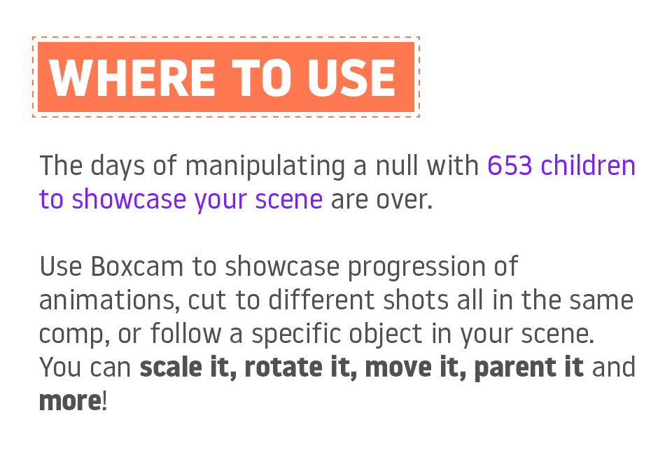
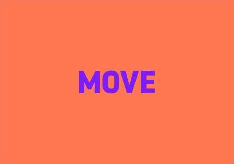
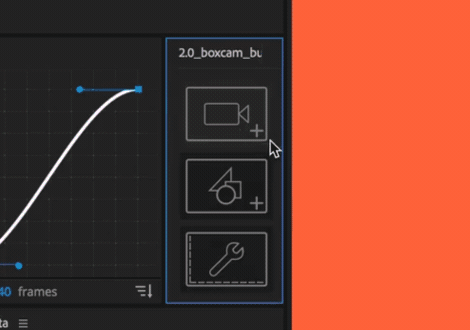
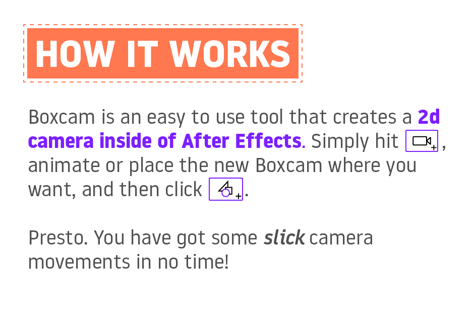
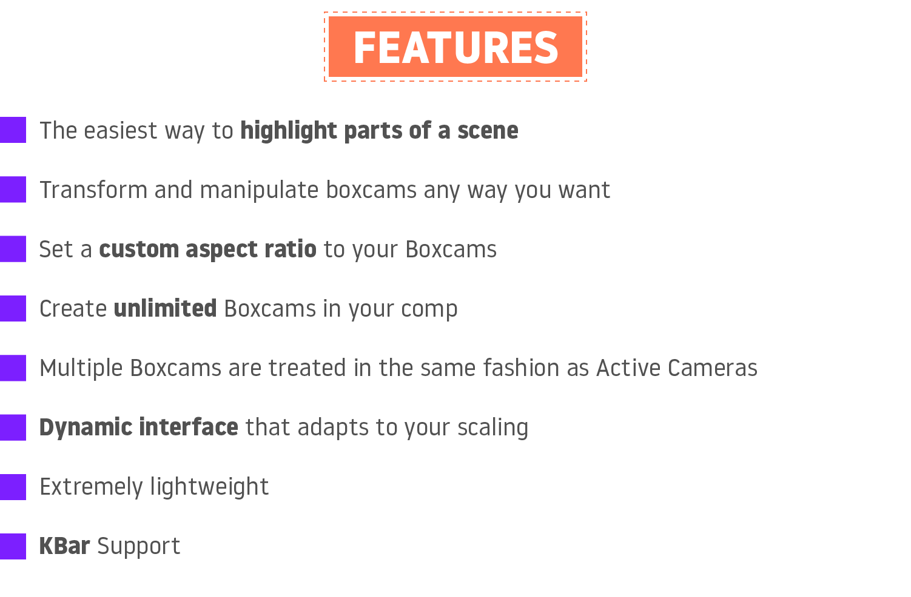
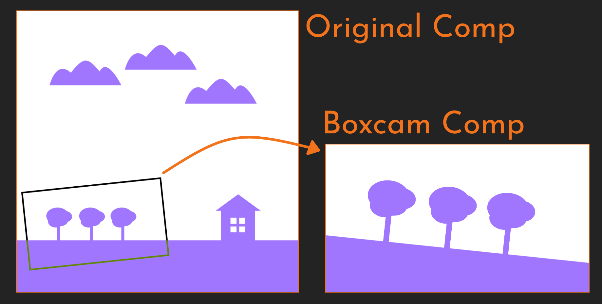
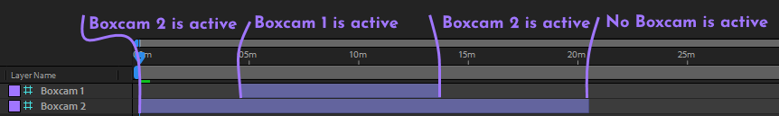

*Script by rebane2001, logo and promo assets by [Danny Perry](https://www.dannyperry.me/)*

---

  
  
  

# About this project

Boxcam 1 was a free tool I released back in July 2018. The November of the same year I discontinued the first version and released Boxcam 2 for $19.99 on [aescripts](https://aescripts.com/boxcam/), collaborating with [Danny Perry](https://www.dannyperry.me/) for new promo assets.

7 years later, in 2025, I decided to discontinue the paid version of Boxcam 2 and open-source it for everyone to use for free. I did so for two reasons - I think design tools should be accessible to everyone, and I was fed up with having to deal with support tickets and updates.

# Usage Guide

## Downloading and installing
Head to the [Releases](https://github.com/rebane2001/Boxcam/releases) and download the latest .jsx file.

To install it, move the downloaded file into your ScriptUI Panels folder:
- `Program Files/Adobe/Adobe After Effects/Support Files/Scripts/Script UI Panels` (Windows)  
- `Applications/Adobe After Effects/Scripts/Script UI Panels` (Mac OS)  

## What does it do?
Boxcam lets you create a 2D box, which will act as a camera.  
Everything inside of the box will be visible in the final result.  

## Usage
After installation you should find Boxcam.jsxbin under the **Window** menu in After Effects, open it and you’ll get the Boxcam panel.

To use Boxcam, you’ll have to first create a Boxcam camera in an existing Composition, then create a new Composition that will contain the output of the Boxcam.

### Creating a Boxcam camera
You can create a new Boxcam by clicking the  button.
If you wish to instead convert an existing layer to function as a Boxcam, hold ctrl while clicking.

### Using the camera
You can transform and animate the Boxcam in almost any way you want - **scale, position and rotate** - you can even use anchor points or **parent** it to other layers.
What is seen inside of the Boxcam is what will be seen in the final output.

### Multiple cameras
If you want to have **multiple Boxcams** in a single Composition, you can!
Just make sure all your **Boxcam layer names start with “Boxcam”**.
Just like normal After Effects 3D cameras, the topmost active layer will be the active camera.

### Creating the output Composition
To see the output of the Boxcam, you will need to create a new Composition that contains your original Composition.
The easiest way to do it is just to click on the  button.

### Custom resolutions
Let’s say your working comp has a resolution of **4096x4096**, but you would like your Boxcam to output in **1920x1080** instead. This is what the **custom resolutions** feature is for.

Click the  button and enable **"Use custom Boxcam size"**.

You can now enter custom resolutions you’d like to use.

After setting a custom resolution, you can **create your Boxcam as usual**, the resolution of your Boxcam and the output Composition will match the resolutions you picked.

If you want to **update** an existing Boxcam’s custom resolution, just **ctrl+click** the  button.

If you want to **update** an existing output Composition, **ctrl+click**  while being in the Composition.

### Using an existing Composition for the output (obsolete)
While it’s not recommended to use an existing Composition for the output, it can be done.

Add the source Composition with a Boxcam in it to the existing Composition, select the layer with your source Composition and **ctrl+click** the  button in the Boxcam panel.

**Note:** The resolution of the existing Composition will be set to match the resolution of the Boxcam.

## KBar
New in **version 2.1** is **KBar** support.

To use it, just add the JSX file in KBar and set the **argument field** to one of the following:

- `create_boxcam`
- `turninto_boxcam`
- `create_output_comp`
- `update_output_comp`
- `custom_res_menu`
- `custom_res_set`
- `view_licensing`

## Notes
If you **can’t see the border** around a Boxcam, you can either **add a background layer** to your Composition or **disable the Adjustment Layer** switch of the Boxcam layer.

## Support

Since I am offering Boxcam 2 for free now, I'll provide support on an as-is basis. If you think you've found a bug or something to improve, open an issue on GitHub.

# Changelog

### v2.8 - Jul 2, 2025
- Remove licensing-related code.
- Make Boxcam 2 open-source and available for free.

### v2.7.1 - Jul 8, 2024
- Minor licensing framework fix.

### v2.7 - Jul 7, 2024
- Updated the licensing framework to fix issues.

### v2.6 - Mar 28, 2021
- Updated the licensing framework to fix issues.
- Fixed an issue where scaling would sometimes not animate properly on trimmed clips (ctrl+click the Output Composition button to apply this patch in old comps made with previous Boxcam versions).

### v2.5 - Aug 29, 2019

> This update is recommended for all macOS users, as the script might otherwise stop working after updating to macOS 10.15

- Upgraded licensing framework to support macOS 10.15 'Catalina'

### v2.4 - Jun 13, 2019
- Fixed bug when moving Boxcam output layer in time in CC 2019 (Thanks Maxim Ivanov for letting me know!)
- Fixed bug when ctrl+clicking the Create Comp button
- Verified that all the versions from CS6 to CC2019 still work properly

### v2.3 - May 28, 2019
- Added a button to hide the Licensing button
- Minor UI code changes
- Minor improvements to the readme PDF

### v2.2 - Feb 15, 2019
- Added a "Help and activation" button to the main UI
This can be disabled by setting the "cleanUI" parameter to 1 in the After Effects prefs file (this is just a temporary solution, for now)

### v2.1 - Feb 12, 2019

> Boxcam now supports KBar, awesome!

- Added support for KBar
- Updated PDF to include information about KBar
- Minor code improvements

### v2.0 - Nov 26, 2018

> Boxcam 2 is a major upgrade with a completely redesigned responsive UI that we are sure you will love.
>
> If you purchased Boxcam 1 you will get a discount towards Boxcam 2 equal to the amount you paid for v1. Simply login to the same account and the discounted price will be automatically shown on the product page.
>
> And if you upgrade before November 30, 2018, you can use code CYBER during checkout to save an additional 25%

*(2025 editors note - Boxcam 1 was set your own price, so I thought it would be fair to offer the newer version for cheaper to those who chose to pay for a free product)*

- Completely redesigned the UI to be responsive, intuitive and user-friendly
- Made new and better documentation and tutorial video
- Added support for multiple separate Boxcams in the same Composition
- Added support for partial-time Boxcams
- Added an intuitive one-click button to create the output Composition
- Improved updating/applying Compositions
- Fixed new compositions not appearing in the correct folder
- Other minor improvements and bugfixes

### v1.3 - Nov 6, 2018

> This update is just a hotfix for any issues CC2019 might bring, but there will be a new and improved version of Boxcam with a ton of changes out soon!

- Made compatible with CC2019 (still works with older versions)
- Fixed a bug with borders not working correctly

### v1.2 - Aug 19, 2018
- Fixed a bug that incorrectly set Boxcam's border size when using custom resolutions

### v1.1 - Aug 13, 2018

> Hi!
> I've been really happy with the reception of Boxcam and I couldn't be happier to see the workflow of so many After Effects users simplified.
> One of the main problems I noticed was users experiencing difficulties when using different resolutions for their compositions.
> Today I'm introducing a new version of Boxcam with support for custom resolutions to address that.
> For an example, you can now easily create a Boxcam of the size 1920x1080 in a composition of the size of 10000x10000.
> Check out the update below!

- Added support for custom resolutions (for an example, you can now create a Boxcam of the size 1920x1080 in a composition of the size 10000x10000)
- Added a button to access said custom resolutions
- Improved handling of resolutions
- Improved error messages to be more descriptive (especially the ones about resolutions)
- Improved the included PDF by adding/fixing information and including a section for the new custom resolutions
- Made button label text dynamic, it will now look better at smaller panel sizes

### v1.0 - Jul 17, 2018
- Initial release
